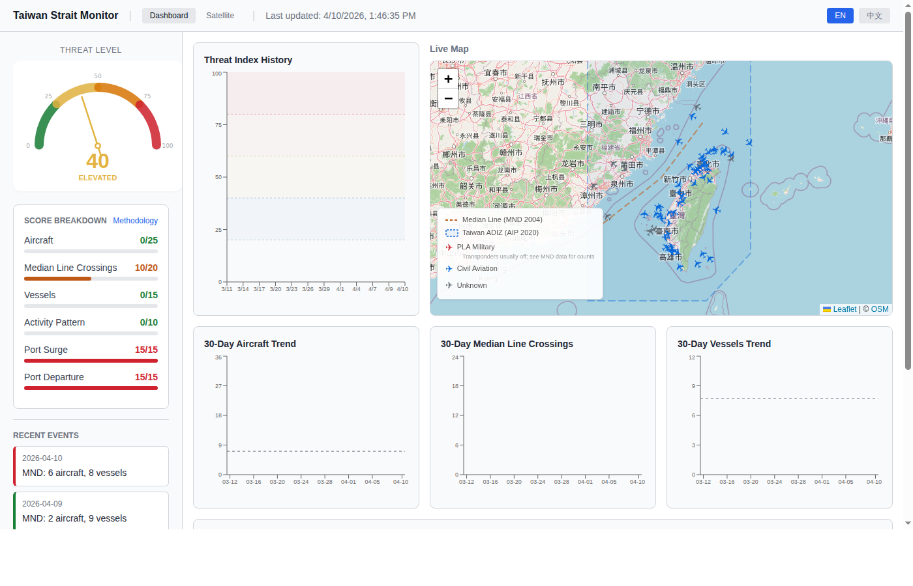
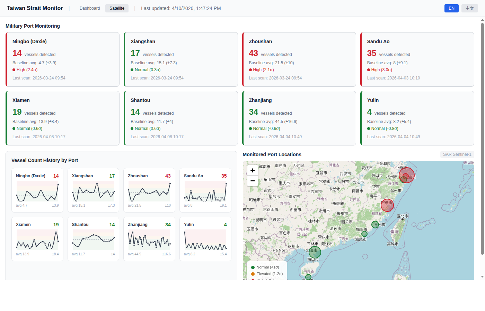

# Taiwan Strait Monitor

Real-time monitoring dashboard for military activity in the Taiwan Strait, combining multiple OSINT data sources into a unified threat index.

## Screenshots

### Dashboard


### Satellite Port Monitoring


## Data Sources

| Source | Type | Update Frequency |
|--------|------|-----------------|
| [Taiwan MND](https://www.mnd.gov.tw/) | PLA aircraft & vessel counts, median line crossings | Scraped daily |
| [OpenSky Network](https://opensky-network.org/) | Live ADS-B aircraft positions & headings | Polled every 30s |
| [Copernicus Sentinel-1](https://dataspace.copernicus.eu/) | SAR satellite imagery for port vessel detection | Every 12 hours |
| Google News RSS | Taiwan Strait related news articles | Hourly |

## Features

- **Threat Index** (0–100): Composite score with statistical anomaly detection against 30-day rolling baselines
- **Live Map**: Real-time aircraft positions with heading rotation, median line & ADIZ overlay
- **Military Port Monitoring**: 8 naval ports tracked via SAR satellite with CFAR vessel detection
- **Dark Vessel Detection**: SAR vessel count minus AIS count estimates non-civilian vessels
- **Bilingual**: English / 中文 interface

## Architecture

```
backend/              FastAPI + SQLite + APScheduler
├── routers/          API endpoints (threat, aircraft, satellite, mnd, news)
├── scrapers/         MND scraper, OpenSky poller, SAR processor, AIS collector
├── services/         Threat index calculation, water mask, CFAR detection
└── scripts/          Backfill & debug utilities

frontend/             Next.js 14 (static export)
├── src/app/          Pages (dashboard, satellite)
├── src/components/   React components (map, charts, cards)
├── src/i18n/         Translations (en.json, zh-CN.json)
└── src/lib/          API client, types

deploy/               systemd service, nginx config, start script
```

## Monitored Ports

**East Sea Fleet**: Ningbo, Xiangshan, Zhoushan, Sandu Ao, Xiamen, Shantou

**South Sea Fleet**: Zhanjiang, Yulin West

## Threat Scoring (100 pts)

| Module | Indicator | Max |
|--------|-----------|-----|
| Military Signals (70) | Aircraft anomaly (σ-based) | 25 |
| | Median line crossings (tiered) | 20 |
| | Vessel anomaly (σ-based) | 15 |
| | Activity pattern (circumnavigation, night ops) | 10 |
| Port Signals (30) | Multi-port surge (σ ≥ 2) | 15 |
| | Multi-port departure (σ ≤ -2) | 15 |

**Levels**: Normal (0–20) → Elevated (21–40) → Tense (41–60) → High Alert (61–80) → Crisis (81–100)

## Setup

### Prerequisites

- Python 3.10+, Node.js 18+
- Copernicus Data Space account (for SAR data)

### Backend

```bash
cd backend
python -m venv venv && source venv/bin/activate
pip install -r requirements.txt

# Configure environment
cp .env.example .env
# Edit .env with your Copernicus credentials:
#   COPERNICUS_CLIENT_ID=...
#   COPERNICUS_CLIENT_SECRET=...
#   AISSTREAM_API_KEY=...  (optional)

uvicorn main:app --host 127.0.0.1 --port 8000
```

### Frontend

```bash
cd frontend
npm install
npm run build    # Static export to out/
```

### Deploy (systemd + nginx)

```bash
sudo cp deploy/strait-monitor.service /etc/systemd/system/
sudo cp deploy/nginx.conf /etc/nginx/sites-available/strait-monitor
sudo ln -s /etc/nginx/sites-available/strait-monitor /etc/nginx/sites-enabled/
sudo systemctl enable --now strait-monitor
sudo systemctl restart nginx
```

## API Endpoints

| Endpoint | Description |
|----------|-------------|
| `GET /api/threat-index` | Current threat score & breakdown |
| `GET /api/threat-index/history?days=30` | Historical threat scores |
| `GET /api/aircraft/live` | Live aircraft positions |
| `GET /api/mnd/latest` | Latest MND report |
| `GET /api/satellite/ports` | SAR port vessel data & anomaly stats |
| `GET /api/satellite/ais-status` | AIS collector health check |
| `GET /api/news` | Related news articles |

## License

For research and educational purposes only.
